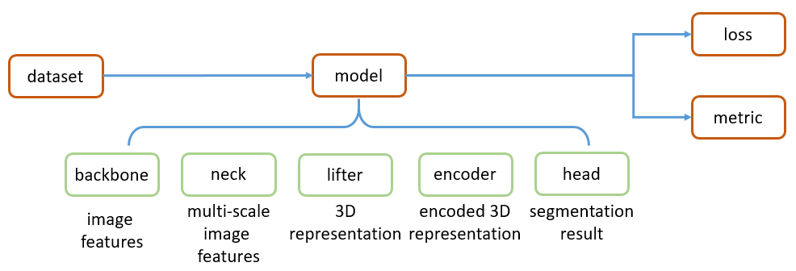

# OpenOcc: Easily Extendable 3D Occupancy Prediction Codebase
OpenOcc is an open source 3D occupancy prediction codebase implemented with PyTorch.

# Highlight Features

- **Multiple Benchmarks Support**. 

  We support training and evaluation on different benchmarks including [nuScenes LiDAR Segmentation](https://www.nuscenes.org/lidar-segmentation), [SurroundOcc](https://github.com/weiyithu/SurroundOcc), [OpenOccupancy](https://github.com/JeffWang987/OpenOccupancy), and [3D Occupancy Prediction Challenge](https://github.com/CVPR2023-3D-Occupancy-Prediction/CVPR2023-3D-Occupancy-Prediction). You can even train with sparse lidar supervision and evaluate with dense annotations. :stuck_out_tongue_closed_eyes:

- **Extendable Modular Design.** 

  We design our pipeline to be easily composable and extendable. Feel free to explore other combinations like TPVDepth, VoxelDepth, or TPVFusion with simple modifications. :wink:

# Demo


# Method

## Pipeline



## Dataset 

| Status             | Name | Description                                                  |
| ------------------ | ---- | ------------------------------------------------------------ |
| :white_check_mark: | ImagePointWrapper | [nuScenes LiDAR Segmentation](https://www.nuscenes.org/lidar-segmentation) |
| :o:                |      | [SurroundOcc](https://github.com/weiyithu/SurroundOcc)       |
| :o:                |      | [OpenOccupancy](https://github.com/JeffWang987/OpenOccupancy) |
| :white_check_mark: |   NuScenes3DOCP   | [3D Occupancy Prediction Challenge](https://github.com/CVPR2023-3D-Occupancy-Prediction/CVPR2023-3D-Occupancy-Prediction) |

## 2D-3D Lifter

### Image2Voxel

| Status             | Name  | Description                                            |
| ------------------ | ---- |  ------------------------------------------------------ |
| :white_check_mark: | TPVDepthLSSLifter | Use estimated depth distribution to lift image features to the voxel space (LSS). |
| :white_check_mark: | TPVPlainLSSLifter | Uniformly put image features on the corresponding ray (MonoScene). |

### Voxel2Rep

| Status             | Name | Description                             |
| ------------------ | ---- | --------------------------------------- |
| :white_check_mark: | TPVDepthLSSLifter, TPVPlainLSSLifter | Perform pooling to obtain TPV features. |
| :o: |      | Perform pooling to obtain BEV features. |

### Image2Rep

| Status             | Name | 3D Scene Representation | Description                                            |
| ------------------ | ---- | ----------------------- | ------------------------------------------------------ |
| :white_check_mark: | TPVQueryLifter | TPV                     | Use deformable cross-attention to update TPV queries   |
| :o:                |      | BEV                     | Use deformable cross-attention to update BEV queries   |
| :o:                |      | Voxel                   | Use deformable cross-attention to update Voxel queries |

## Encoder

| Status             | Name | Description                              |
| ------------------ | ---- | ---------------------------------------- |
| :white_check_mark: | TPVFormerEncoder | Use self-attention to aggregate features |
| :white_check_mark: | TPVConvEncoder   | Use 2D convolution to aggregate features |
| :o:                |      | Use 3D convolution to aggregate features |

## Loss

| Status             | Name | Description                           |
| ------------------ | ---- | ------------------------------------- |
| :white_check_mark: | CELoss | Cross-entropy loss                    |
| :white_check_mark: | LovaszSoftmaxLoss | [Lovasz-softmax loss](Lovasz-softmax) |

# Model Zoo

Coming soon.

# How to use

## Installation

1. Create conda environment with python version 3.8

2. Install pytorch and torchvision with versions specified in requirements.txt

3. Follow instructions in https://mmdetection3d.readthedocs.io/en/latest/getting_started.html#installation to install mmcv-full, mmdet, mmsegmentation, mmdet3d with versions specified in requirements.txt

4. Install timm, numba and pyyaml with versions specified in requirements.txt

5. Install cuda extensions.

```
python setup.py develop
```

## Preparing

1. Download pretrain weights and put them in ckpts/

```
# ImageNet-1K pretrained ResNet50, same as torchvision://resnet50
https://cloud.tsinghua.edu.cn/f/3d0cea3f6ac24e019cea/?dl=1
```

2. Create soft link from data/nuscenes to your_nuscenes_path.
   The dataset should be organized as follows:

```
TPVFormer/data
    nuscenes                 -    downloaded from www.nuscenes.org
        lidarseg
        maps
        samples
        sweeps
        v1.0-trainval
    nuscenes_infos_train.pkl
    nuscenes_infos_val.pkl
```

3. Download train/val pickle files and put them in data/
   nuscenes_infos_train.pkl
   https://cloud.tsinghua.edu.cn/f/ede3023e01874b26bead/?dl=1
   nuscenes_infos_val.pkl
   https://cloud.tsinghua.edu.cn/f/61d839064a334630ac55/?dl=1

## Getting Started

### Training

1. Train TPVFormer for lidar segmentation task.

```
bash launcher.sh config/tpvformer/tpvformer_lidarseg_dim128_r50_800.py out/tpvformer_lidarseg_dim128_r50_800
```

2. Train TPVConv with PlainLSSLifter for lidar segmentation task.

```
bash launcher.sh config/tpvconv/tpvconv_lidarseg_dim384_r50_800_layer10.py out/tpvconv_lidarseg_dim384_r50_800_layer10
```

3. Train TPVConv with DepthLSSLifter for lidar segmentation task.

```
bash launcher.sh config/tpvconv/tpvconv_lidarseg_dim384_r50_800_layer10_depthlss.py out/tpvconv_lidarseg_dim384_r50_800_layer10_depthlss
```

